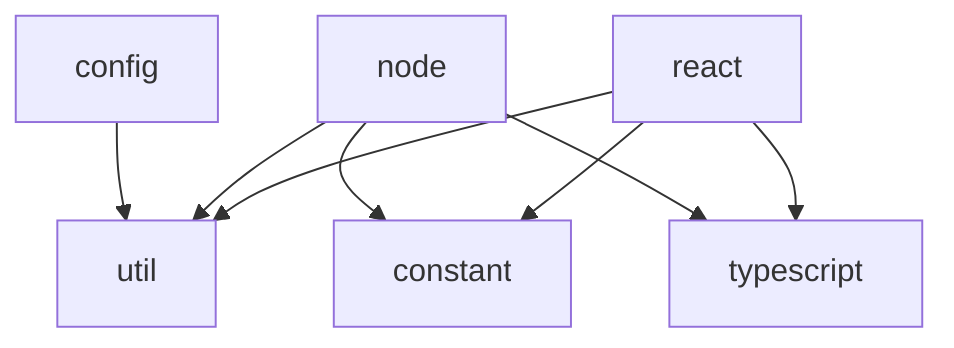

# Codebase Overview

## Architecture

`@cyberskill/shared` is a modular TypeScript utility library built with Vite. Each module is independently importable via [package.json exports](../package.json).

```text
src/
├── config/          → Build tool & linting configurations (ESLint, Vitest, Commitlint, etc.)
├── constant/        → Shared enums and constants (response statuses, etc.)
├── node/            → Node.js-only utilities (Express, MongoDB, CLI, WebSocket, etc.)
├── react/           → React utilities and components (Apollo, i18n, Loading, Toast, etc.)
├── typescript/      → Shared TypeScript type definitions and utility types
└── util/            → Universal utilities (string, object, serializer, validation)
```

## Module Dependency Map



## Key Modules

### `config/`

| Submodule        | Purpose                              | Consumers              |
| ---------------- | ------------------------------------ | ---------------------- |
| `eslint/`        | Shared ESLint flat config            | All CyberSkill projects |
| `vitest/`        | Unit + E2E vitest presets            | All CyberSkill projects |
| `commitlint/`    | Commit message validation            | Git hooks              |
| `lint-staged/`   | Pre-commit file checks               | Git hooks              |
| `env/`           | Type-safe env variable parsing       | Backend services       |
| `graphql-codegen/` | GraphQL code generation setup      | GraphQL projects       |
| `storybook/`     | Storybook configuration preset       | UI projects            |

### `node/`

| Submodule        | Purpose                              | Key Dependencies       |
| ---------------- | ------------------------------------ | ---------------------- |
| `cli/`           | CyberSkill CLI (`cyberskill` bin)    | yargs, chalk           |
| `express/`       | Express.js middleware & CORS setup   | express, cors, helmet  |
| `mongo/`         | MongoDB ODM, controllers, pagination | mongoose               |
| `ws/`            | WebSocket connection management      | ws                     |
| `fs/`            | File system operations               | fs-extra               |
| `upload/`        | File upload handling                 | graphql-upload         |
| `storage/`       | Server-side data persistence         | —                      |
| `package/`       | Package management helpers           | —                      |
| `path/`          | Path constants and resolution        | —                      |
| `command/`       | Shell command execution              | —                      |
| `log/`           | Structured logging                   | consola, chalk         |
| `apollo-server/` | Apollo Server integration            | @apollo/server         |

### `react/`

| Submodule              | Purpose                        | Key Dependencies                |
| ---------------------- | ------------------------------ | ------------------------------- |
| `apollo-client/`       | Apollo Client setup & links    | @apollo/client                  |
| `apollo-client-nextjs/`| Next.js Apollo integration     | @apollo/client-integration-nextjs |
| `apollo-error/`        | GraphQL error display component| @apollo/client, react           |
| `loading/`             | Loading spinner & overlay      | react                           |
| `i18next/`             | i18n setup for React           | i18next, react-i18next          |
| `next-intl/`           | Next.js internationalization   | next-intl                       |
| `toast/`               | Toast notification system      | react-hot-toast                 |
| `storage/`             | Browser storage hooks          | localforage                     |
| `userback/`            | User feedback widget           | @userback/widget                |
| `log/`                 | Client-side logging            | —                               |

### `util/`

| Submodule      | Purpose                                  |
| -------------- | ---------------------------------------- |
| `common/`      | Regex helpers, accent removal, array utils |
| `object/`      | Deep merge, object manipulation          |
| `string/`      | String formatting and processing         |
| `serializer/`  | Data serialization / deserialization      |
| `validate/`    | Input validation and sanitization        |

## Build System

- **Bundler**: Vite 7 with Rollup
- **Output**: Dual ESM + CJS (`preserveModules: true`)
- **Target**: ES2022
- **Types**: `vite-plugin-dts` for `.d.ts` generation
- **Tree-shaking**: Aggressive (`sideEffects: false`)

## File Conventions

| Pattern                    | Purpose                |
| -------------------------- | ---------------------- |
| `index.ts`                 | Module entry / re-exports |
| `*.type.ts`                | Type definitions       |
| `*.util.ts`                | Utility functions      |
| `*.constant.ts`            | Constants and enums    |
| `*.component.tsx`          | React components       |
| `*.test.unit.ts(x)`        | Unit tests (Vitest)    |
| `*.test.e2e.ts(x)`         | E2E tests (Playwright) |

## Path Aliases

| Alias          | Maps to        |
| -------------- | -------------- |
| `#config/*`    | `src/config/*` |
| `#constant/*`  | `src/constant/*` |
| `#node/*`      | `src/node/*`   |
| `#react/*`     | `src/react/*`  |
| `#style/*`     | `src/style/*`  |
| `#typescript/*`| `src/typescript/*` |
| `#util/*`      | `src/util/*`   |
| `#public/*`    | `public/*`     |
